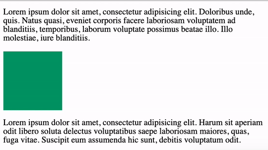

<!-- omit in toc -->
# Animation CSS (débutant)

Les animations CSS permettent d'animer n'importe quel élément sur votre page web. Elles suppriment aussi le besoin d'utilisé du JavaScript ou du JQuerry. Elles sont facile à utiliser une fois qu'on a pris le pas.

- [Transform](#transform)
  - [Translate](#translate)
  - [Scale](#scale)
  - [Rotate](#rotate)
  - [Skew](#skew)
  - [Multiple valeurs](#multiple-valeurs)
- [Transition](#transition)
- [Keyframes](#keyframes)
  - [From & To](#from--to)
  - [Pourcentages](#pourcentages)
- [Amusez-vous](#amusez-vous)

## Transform

Voyons quelques valeurs animables. 

### Translate

Permet de déplacer l'élément sur un axe horizontale (X) ou verticale (Y)

```css
.element{
  transform: translateX(200px) translateY(-50px);
  }
```

> :bulb: il est intéressant de noter que en utilisant translate, les autres contenu ne vont pas bouger.



> :bulb: Il est également possible de combiner les deux axes en une seule ligne `transform: translate(200px, -50px)`

### Scale

Permet d'agrandir l'élément et son contenu. Il est possible de le faire sur l'axe X ou Y. Le paramètre accepté est un chiffre qui détermine le nombre de fois que l'élément est agrandis ou rétrécis.

```css
.element{
  transform: scale(20);
  }
```

> :bulb: il est possible d'utiliser `scaleX` ou `scaleY`

### Rotate

Permet d'éffectuer une rotation dans le sens des aiguilles d'une montre avec votre élément et son contenu. Il faut indiquer un paramètre en `deg` (degrés) et il peut être positif ou négatif.

```css
.element{
  transform: rotate(45deg);
  }
```

> :bulb: il est possible d'utiliser `rotateX`, `rotateY` ou `rotateZ`

[Voir des exemples de rotation](https://codepen.io/team/css-tricks/pen/d31be2118a19782d2c4fcfb048351ccf)

[Voir des exemples de rotation sur axes](https://codepen.io/team/css-tricks/pen/ebb6b5a5cec86aa04168f03e26c7501c)

### Skew

Permet d'incliner un élément sur l'axe X ou Y. Prend comme paramètre une valeur en degrés (`deg`).

```css
.element{
  transform: skew(20deg, 20deg);
  }
```

> :bulb: il est possible d'utiliser `skewX` et `skewY`

[Voir des exemples de skew](https://codepen.io/team/css-tricks/pen/povNBmQ)

### Multiple valeurs

Il est tout à fait possible d'écrire plusieurs valeurs à la propriété transform, il suffit de les espacer.

```css
.element{
  transform: translate(200px, -50px) scale(20);
  }
```

## Transition

Voyons maintenant comment on peut passer d'un état à un autre. Oui, ça s'appel une transition.

Pour ce faire définissons 2 états

```css
.element{
  width: 100px;
  padding: 50px 0;
  line-height: 0;
  margin: 60px auto;
  background-color: red;
  color: yellow;
  border-radius:50px;
  text-align: center;
}

.element:hover{
  background-color: black;
  transform: scale(2);
}
```

Tel quel notre "animation" se ferra correctement sur le survol de l'élément par le curseur. Mais ce n'est pas très lisse. 

On peut donc appliquer une propriété `transition` à notre élément de base. On indique une valeur en temps (sec).

```css
.element{
  transition: 1s;
}
```

Comme nous avons modifié des propriétés animables en CSS, votre navigateur se charge de faire la transition entre les différentes propriétés.

Il est possible aussi de spécifier le temps de transition pour chacune de ces propriétés individuellement.

```css
.element{
  transition: background-color 1s, transform 2s;
}
```

Vous pouvez aussi spécifier un délai avant que la transition ne se lance. Pour se faire il suffit de préciser le temps du délai après avoir indiqué le temps de la transition

```css
.element{
  transition: background-color 1s 2s, transform 2s 5s;
}
```

Cela nous fait déjà beaucoup de contrôle sur notre transition, mais il existe une dernière valeur que l'on peut associer à notre transition. Il s'agit de la "fonction de temps" (timing-function). Cela détermine l'accélération de notre animation. Par défaut il s'agit de `linear` mais il en existe d'autres comme `ease-in`, `ease-out`,... Vous pouvez également créer votre propre accélération avec le `cubic-bezier`.

```css
.element{
  transition: background-color 1s 2s ease-in, transform 2s 5s ;
}
```

[Cubic-bezier](https://cubic-bezier.com)

[Liste des propriété animables](https://developer.mozilla.org/en-US/docs/Web/CSS/CSS_animated_properties)

## Keyframes

### From & To

C'est avec les keyframes qu'on va définir comment notre animation fonctionne et qu'on va pouvoir allez plus loin. Ce sont des "bloc" d'animation qu'on va pouvoir appliquer sur nos éléments. On va définir un état de base (from) et on va définir un état d'arrivé (to). Voyons cela en pratique.

```css
@keyframes move-right{
  from{ transform: translate(0) }
  to{ transform: translate(500px) } 
}
```

On définit notre animation, dans ce cas un déplacement de 500px vers la droite.

Pour appliquer cette animation à un élément il suffit d'utiliser la propriété `animation-name` et `animation-duration`.

```css
.element{
  animation-name: move-right;
  animation-duration: 3s;
}
```

> :exclamation: il est important de mettre le même nom que celui appliqué à la keyframe et il est également nécessaire de mettre une durée.

On retrouve également quelques propriétés déjà vue dans les transition:

* animation-timing-function: détermine l'accélération de l'animation
* animation-delay: détermine le délai avant de commencer l'animation
* animation-direction: détermine le sens de l'animation.
  
[En voici d'autres](https://css-tricks.com/almanac/properties/a/animation/#sub-properties)

### Pourcentages

Il est également possible de diviser votre animation en utilisant des %. Pour chaque x% on va définir les états de notre animation. De 0% à 100% est accompli en fonction de la durée définie.

```css
@keyframes mymove {
  0%   {top: 0px;}
  25%  {top: 200px;}
  50%  {top: 100px;}
  75%  {top: 200px;}
  100% {top: 0px;}
}
```

## Amusez-vous

C'est à vous de jouer maintenant, créez des animations, tentez des choses, voyez comment ça se comporte.

Voici un [lien vers un site](https://animista.net/) qui vous permet d'expérimenter toutes sortes d'animation.

Consultez aussi [cette page interactive](https://rupl.github.io/unfold/) pour voir la puissance du CSS

Et voici 3 petits jeux réalisés en CSS:

* [Roadmap](http://victordarras.fr/cssgame)
* [Target Carnival](https://codepen.io/una/pen/NxZaNr)
* [Tic-Tac-Toe](https://codepen.io/alvaromontoro/pen/BexWOw)